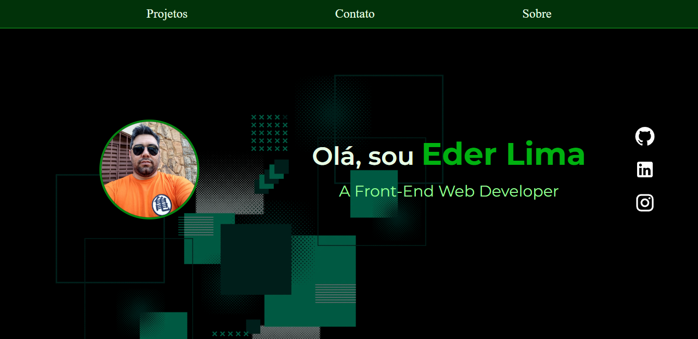

# Apresentação Pessoal

Projeto portfolio para apresentação pessoal, com finalidade de participar do desafio para vaga de desenvolvedor React Junior.


## Referência

 - [Fontes - Goolge fonts](https://fonts.google.com/)
 - [Alguns Icones e componentes - Material UI](https://mui.com/material-ui/)
 - [Animações - Plugin Tailwind Animated](https://www.tailwindcss-animated.com/)


## Documentação da API

#### Retorna todos os itens

```http
  https://api.github.com/users/{userName}/repos
```

| Parâmetro   | Tipo       | Descrição                           |
| :---------- | :--------- | :---------------------------------- |
| `url` | `string` | Realizar fetch no endpoint, não é necessário autenticação |


## Apêndice

Coloque qualquer informação adicional aqui


## Autores

- [Eder Lima](https://www.github.com/EderLimaDev)

## Documentação de cores

| Cor tom Verde              | Hexadecimal                                                |
| ----------------- | ---------------------------------------------------------------- |
| 50       |  #e7ffe5 |
| 100      |  #c8ffc7 |
| 200       |  #95ff95 |
| 300      |  #3dff44 |
| 400       |  #25f62f |
| 500      |  #05dd14 |
| DEFAULT       |  #00b110 |
| 700      |  #058612 |
| 800      |  #0b6915 |
|900      |  #0e5918 |
| 950     |  #013209 


## Screenshot




## Stack utilizada

**Front-end:** React, TailwindCSS


## Licença

[MIT](https://choosealicense.com/licenses/mit/)

